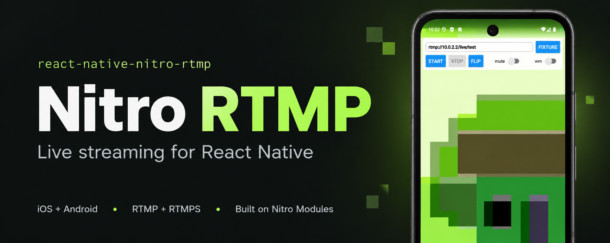

# react-native-nitro-rtmp

Live video streaming over RTMP and RTMPS for React Native, built on [Nitro Modules](https://nitro.margelo.com/).

The library captures the camera and the microphone, composites them with overlay layers on the GPU, encodes with the platform's hardware H.264 and AAC encoders, and publishes through a sans-IO RTMP core shared by iOS and Android. JavaScript configures the scene and the session; frames never cross into JavaScript.

> Early release. The API is small on purpose and may still change before 1.0.

## Features

- Camera (front/back, switchable while live) and microphone (mute keeps sending silence so the timeline never breaks)
- A mixer with ordered layers placed in normalized rectangles: the camera and PNG/JPEG image overlays today, one interface for future layer types
- `PreviewView` renders exactly what is sent (the front camera is mirrored in the preview only)
- H.264 Main profile without B-frames with configurable bitrate, frame rate and keyframe interval; AAC-LC at 48 kHz
- `rtmp://` and `rtmps://` (TLS through the system trust store, SNI and host name verification)
- Typed session states, error codes and counters for both the session and the encoders
- `pushVideo` / `pushAudio` to feed your own encoder output through the same session
- A portable C++ protocol core with host tests, including a loopback against a real RTMP server

## Requirements

- React Native with the New Architecture (developed against 0.86) and `react-native-nitro-modules` ^0.37
- iOS: the minimum version of your React Native release. Android: API 24+
- The example app is an Expo project with a development client; Expo Go cannot load native modules

## Installation

```sh
npm install react-native-nitro-rtmp react-native-nitro-modules
cd ios && pod install
```

### Permissions

**iOS**: add `NSCameraUsageDescription` and `NSMicrophoneUsageDescription` to `Info.plist` (or `expo.ios.infoPlist` in `app.json`). `camera.start()` and `mic.start()` request access and reject with `permissionDenied` when it is refused.

**Android**: the library's manifest declares `CAMERA` and `RECORD_AUDIO`. `useRtmpStream` requests the permissions it needs when activated (camera only when `audio: false`). When using the low-level source factories directly, request permissions yourself before calling `start()`.

## Usage

`useRtmpStream` owns the camera, microphone, mixer and publisher. It starts the preview, exposes reactive state, and stops capture and publishing on unmount. Call `start(url)` when the user is ready to go live.

```tsx
import { Button, StyleSheet, Text, View } from 'react-native';
import { RtmpPreview, useRtmpStream } from 'react-native-nitro-rtmp';

export function Broadcast({ url }: { url: string }) {
  const stream = useRtmpStream({ camera: 'back', audio: true });

  return (
    <View style={{ flex: 1 }}>
      <RtmpPreview stream={stream} style={StyleSheet.absoluteFill} />
      <Button
        title="Go live"
        disabled={
          !stream.ready || stream.isBusy || stream.state === 'publishing'
        }
        onPress={() => void stream.start(url).catch(console.warn)}
      />
      <Button
        title="Stop"
        onPress={() => void stream.stop().catch(console.warn)}
      />
      <Button title="Flip camera" onPress={stream.flipCamera} />
      <Text>{stream.error?.message}</Text>
    </View>
  );
}
```

`stop()` stops publishing while keeping the preview running, and cancels an in-flight `start()`. Pass `active: false` to stop both capture and publishing. For navigation, pass your screen's focus state as `active`; also include app foreground state if capture should stop in the background. Activation requests camera/microphone access, so use `active: false` until you want to ask for permission. React Strict Mode and rapid deactivation/reactivation are handled by waiting for the previous capture session to finish shutting down.

### Controls and state

```tsx
stream.setMuted(true); // Keeps the audio timeline, sends silence
stream.setCameraPosition('front'); // Switches camera while previewing or live
stream.flipCamera();

// These values update React automatically:
stream.ready;
stream.state;
stream.isBusy;
stream.error;
stream.camera;
stream.muted;
```

`start(url)` waits for capture readiness and resolves when publishing. `start()` and `stop()` return promises; handle their rejections in event handlers. Capture and transport failures also appear in `stream.error` as `RtmpCaptureError` or `RtmpPublisherError`. A cancelled or inactive start rejects with `notReady`. A capture startup failure releases any partially started resources; fix the cause and toggle `active` off/on to retry. Stopping a stream does not revoke its permissions.

### Configuration

```tsx
const stream = useRtmpStream({
  active: isFocused,
  camera: 'back',
  audio: true,
  video: { width: 720, height: 1280, frameRate: 30, bitrateKbps: 2500 },
  statsIntervalMs: 1000,
});

// Populated only when stats polling is enabled and capture is ready.
stream.stats?.publisher.bytesSent;
stream.stats?.mixer.droppedFrames;
```

| Option            | Default                                           | Behavior                                                                             |
| ----------------- | ------------------------------------------------- | ------------------------------------------------------------------------------------ |
| `active`          | `true`                                            | Enables capture/preview; `false` stops capture and publishing                        |
| `camera`          | `'back'`                                          | Initial camera; changing this prop switches the camera without restarting the stream |
| `audio`           | `true`                                            | Enables the microphone; `false` requires only camera permission                      |
| `video`           | 720 × 1280, 30 fps, 2500 kbps, 2-second keyframes | Partial `VideoSettings`; dimensions must be positive even integers                   |
| `audioSettings`   | 48000 Hz, 1 channel, 128 kbps                     | Partial `AudioSettings`; capture supports 48000 Hz and 1 or 2 channels               |
| `statsIntervalMs` | `0`                                               | Opt-in stats polling; `0` disables it                                                |

Changing video/audio configuration or the stats interval recreates the capture session and stops any current broadcast; call `start()` again to resume publishing. Passing a new options object with unchanged values does not restart it. Camera changes and mute controls apply without recreating capture. Only one hook should own a device's camera/microphone at a time.

### Image overlays and advanced composition

The hook exposes `stream.mixer` for the existing layer API. It is `undefined` before initialization and while inactive, and is replaced when the capture session is recreated. Attach custom layers in an effect that depends on this mixer, and remove them in cleanup:

```tsx
import { useEffect } from 'react';
import { createImageLayer } from 'react-native-nitro-rtmp';

const { mixer } = stream;
useEffect(() => {
  if (!mixer) return;
  let cancelled = false;
  const image = createImageLayer();
  void image
    .load(imageFileUri)
    .then(() => {
      if (!cancelled) {
        mixer.addLayer(image, { x: 0.7, y: 0.05, width: 0.25, height: 0.1 });
      }
    })
    .catch(console.warn);
  return () => {
    cancelled = true;
    mixer.removeLayer(image);
  };
}, [mixer, imageFileUri]);
```

The mixer is owned by the hook: use it to manage your additional layers, and configure capture through hook options. For custom encoder input or full control over resource ownership, the original factories and `PreviewView` remain available unchanged. See the API below and the [fixture example](example/src/FixtureScreen.tsx).

## API

### `useRtmpStream(options?): RtmpStream`

Returns the reactive state and controls described above. Native capture starts after mounting, never during render. Preview activation and publishing are separate; activation does not automatically connect to an RTMP server.

### `RtmpPreview`

Props: `stream`, `resizeMode` (`'cover'` or `'contain'`) and the same view props as `PreviewView`. Renders the hook-owned mixer's composition. Multiple previews may display the same stream.

### `createPublisher(): RtmpPublisher`

| Member | Description |
| --- | --- |
| `state` | `'idle' \| 'connecting' \| 'connected' \| 'publishing' \| 'stopped' \| 'failed'` |
| `stats` | `bytesSent`, `queuedBytes`, `videoTags`, `audioTags`, `rejectedFrames`, `droppedBeforeKeyframe`, `invalidFrames`, `timestampClamps`, `lastVideoTimestamp`, `lastAudioTimestamp` |
| `start(url)` | Opens the socket (TLS for `rtmps://`), runs the handshake and the connect/createStream/publish exchange. Resolves at `publishing`; rejects with an `RtmpPublisherError` before that. Later failures go to `onError` |
| `stop()` | Sends FCUnpublish/deleteStream, drains the send queue and closes the socket |
| `setMixer(mixer?)` | Attaches a mixer: its encoders start when the session reaches `publishing` and stop when it ends. `undefined` detaches |
| `setMetadata(metadata)` | Values for the `onMetaData` tag: `width`, `height`, `frameRate`, `videoBitrateKbps`, `audioSampleRate`, `audioChannels`, `audioBitrateKbps`, `encoder` |
| `onStateChange(cb)`, `onError(cb)` | Session callbacks |
| `pushVideo(annexB, ptsMs, dtsMs)`, `pushAudio(adts, ptsMs)` | External sources: one H.264 Annex-B access unit (the first one an IDR with SPS/PPS) or one ADTS AAC frame |

### `createMixer(): Mixer`

| Member | Description |
| --- | --- |
| `video` | `{ width, height, frameRate, bitrateKbps, keyframeIntervalSeconds? }`, changeable while not encoding |
| `audio` | `{ sampleRate, channels, bitrateKbps }` |
| `stats` | `capturedFrames`, `renderedFrames`, `droppedFrames`, `encodedVideoFrames`, `encodedAudioFrames`, `videoBitrateKbps`, `encoderFailures` |
| `isEncoding` | True while attached to a publishing session |
| `addLayer(layer, frame?)` | Z order is the order of addition. `frame` is in normalized output coordinates (0..1); omitted means the whole frame |
| `removeLayer(layer)`, `setLayerFrame(layer, frame)` | Scene changes, allowed while live |
| `setAudioSource(mic?)` | Attaches or detaches the microphone |
| `onError(cb)` | Encoder failures as `CaptureError` |

### Layers and sources

- `createCameraSource()`: `position` (`'front' | 'back'`, switchable while running), `isRunning`, `start()`, `stop()`
- `createMicrophoneSource()`: `muted`, `isRunning`, `start()`, `stop()`
- `createImageLayer()`: `load(fileUri)` for a PNG or JPEG `file://` URI, `isLoaded`

### `PreviewView`

Props: `mixer`, `resizeMode` (`'cover'` by default, or `'contain'`) and the usual view props. Several previews can share one mixer.

### Errors

- `RtmpPublisherError` codes: `invalidUrl`, `handshakeFailed`, `connectRejected`, `invalidApp`, `publishBadName`, `streamAlreadyExists`, `serverClosed`, `protocolError`, `notReady`, `connectFailed`, `tlsFailed`, `socketClosed`, `timeout`
- `RtmpCaptureError` codes: `permissionDenied`, `cameraUnavailable`, `configurationFailed`, `encoderFailed`
- `toPublisherError(e)` and `toCaptureError(e)` turn any rejection into the typed error

## How it works

```
CameraSource ──frames──┐
ImageLayer ────────────┤→ Mixer (GPU compositor) ──→ H264Encoder ──Annex-B──┐
                       └───────────────────────────→ PreviewView             ├→ session queue → RTMP core → socket
MicrophoneSource ──PCM──→ AacEncoder ──ADTS──────────────────────────────────┘
```

- The encoder never sees the camera. Every frame takes one GPU pass, so overlays are just more layers and the preview shows the frame that is sent.
- Frames never enter JavaScript. Encoder output is copied once and posted to the session queue natively.
- One drop policy: capture callbacks are never blocked. When the compositor or the encoder is busy, the newest camera frame replaces the waiting one and `droppedFrames` counts it.
- Both streams use the same monotonic capture clock. The first encoded video frame defines t = 0, audio captured before it is dropped, and that frame is forced to be a keyframe.
- The RTMP core in `cpp/nitrortmp` is sans-IO: it consumes and emits bytes and the platforms own the socket. It is tested on the host against a loopback RTMP server and golden FLV fixtures.

iOS uses AVCaptureSession, Metal, VideoToolbox and AudioToolbox. Android uses Camera2, OpenGL ES 2.0, MediaCodec and AudioRecord.

## Limitations

- No rotation while publishing, adaptive bitrate, automatic reconnect or background mode yet
- H.264 and AAC only; no local recording
- The iOS simulator has no camera. The example app's fixture screen streams a pre-encoded clip through `pushVideo` / `pushAudio` for simulator and regression checks

## Verifying a stream

```sh
scripts/verify-stream.sh --listen --width 720 --height 1280 --fps 30 --duration 10
```

starts `ffmpeg -listen`, waits for one publish and checks codecs, size, frame rate, keyframe interval, timestamp monotonicity, A/V alignment and a clean decode. The example app reads `EXPO_PUBLIC_*` variables (see `example/src/env.ts`) to start automatically and to switch cameras, mute and toggle the watermark on a schedule.

## Third-party code

`cpp/third_party/media-server` vendors [ireader/media-server](https://github.com/ireader/media-server) and [ireader/sdk](https://github.com/ireader/sdk) (MIT) with one patch that adds an `onStatus` callback to the RTMP client. See `cpp/third_party/media-server/UPSTREAM.md` and `scripts/sync-media-server.sh`.

## Contributing

See [CONTRIBUTING.md](CONTRIBUTING.md) for the development workflow, the C++ host tests, stream verification and the vendored sources.

## License

MIT

---

Made with [create-react-native-library](https://github.com/callstack/react-native-builder-bob)
